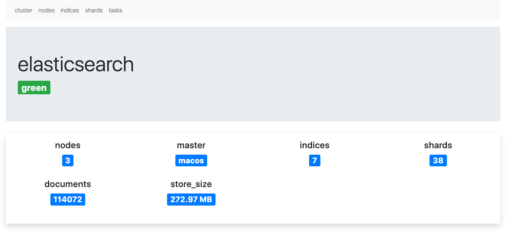
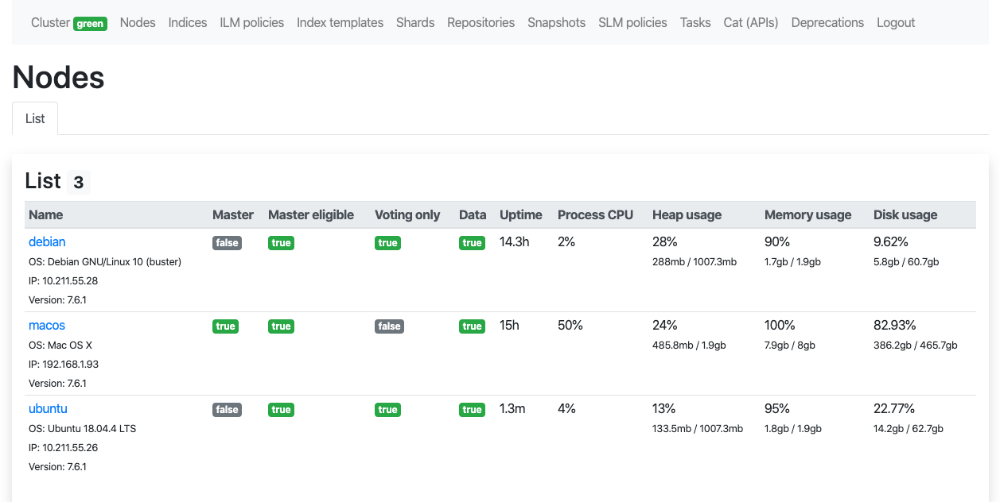
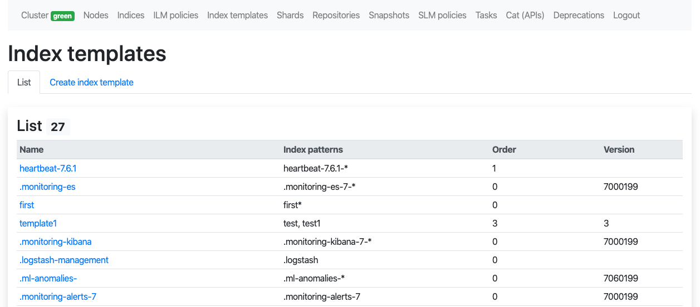
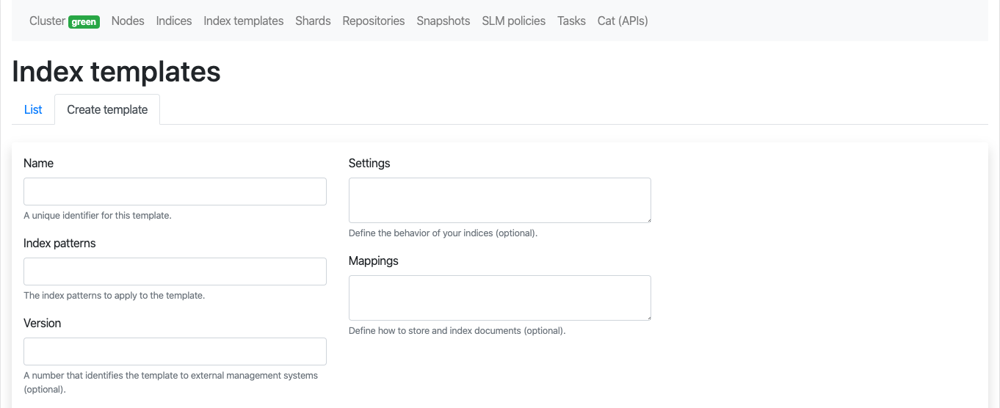
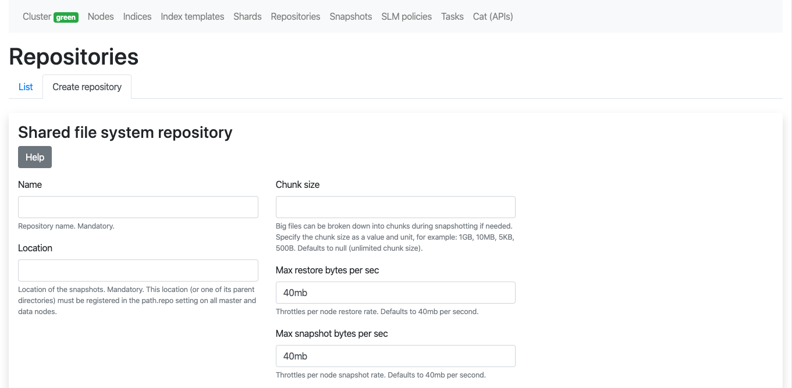
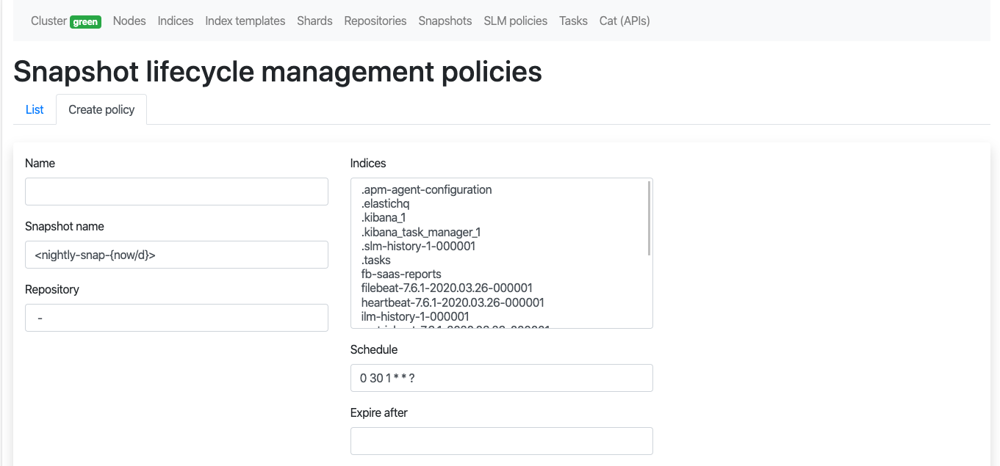
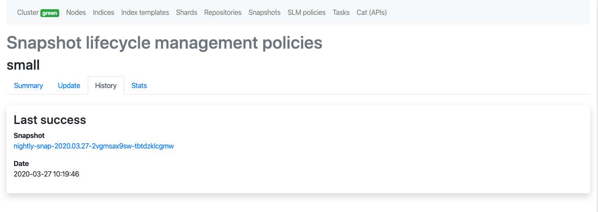
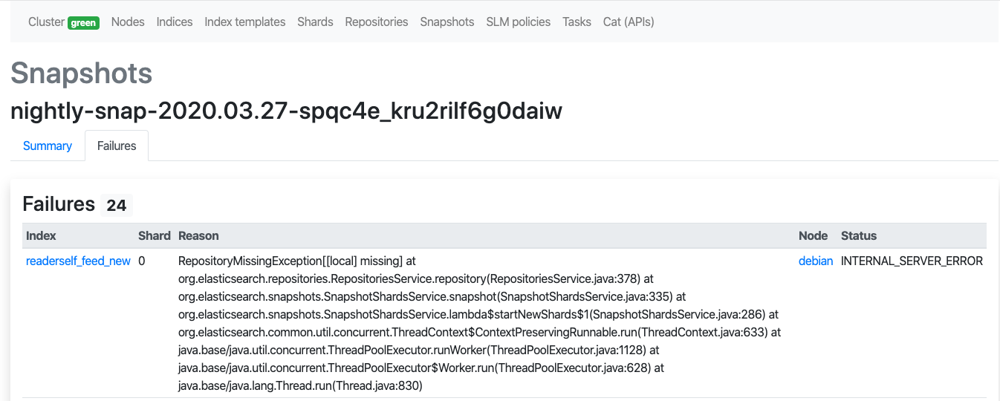
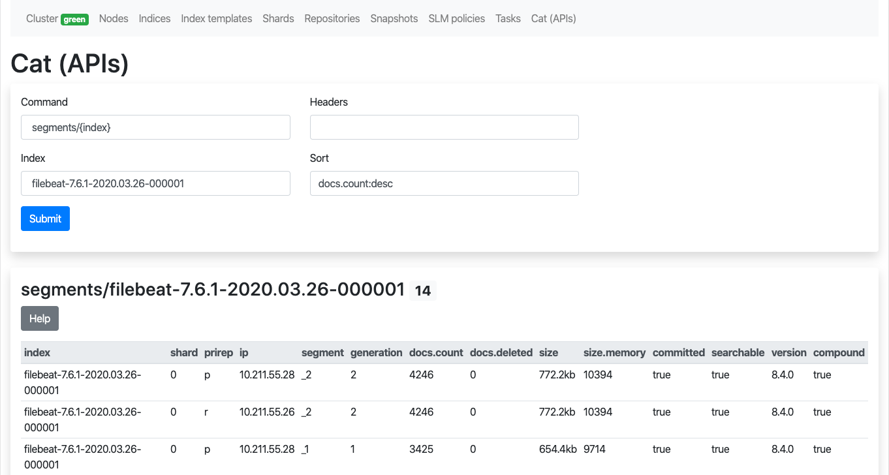

## Installation

```
composer install

yarn install
yarn encore production

bin/console security:encode-password
# Encode a password

cp .env.dist .env
# Edit ELASTICSEARCH_URL, ELASTICSEARCH_USERNAME, ELASTICSEARCH_PASSWORD, EMAIL and ENCODED_PASSWORD
```

### Features

- [x] Cluster: basic metrics
- [x] Nodes: list, read
- [x] Indices: list, read
- [x] Indices: create, delete, close, open, force merge, clear cache, flush, refresh, reindex
- [x] Documents (by index): list
- [x] Aliases (by index): list, create, delete
- [x] Index templates: list, read
- [x] Index templates: create, update, delete
- [x] Shards: list
- [x] Repositories: list, read
- [x] Repositories: create (fs), delete, cleanup, verify
- [x] Snapshots: list, read
- [x] Snapshots: create, delete, failures, restore
- [x] Snapshot lifecycle management policies: list, read
- [x] Snapshot lifecycle management policies: create, update, delete, execute, history, stats
- [x] Tasks: list
- [x] Cat APIs: list
- [x] Deprecations info
- [x] Authentication (Symfony)

### Todo

- [ ] Indices: update mappings
- [ ] Documents (by index): filter, delete
- [ ] Cluster: stats, reroute
- [ ] Repositories: create (url, source, s3, hdfs, azure, gcs)

## Screenshots


---

---

---

---

---

---

---

---

---

---

