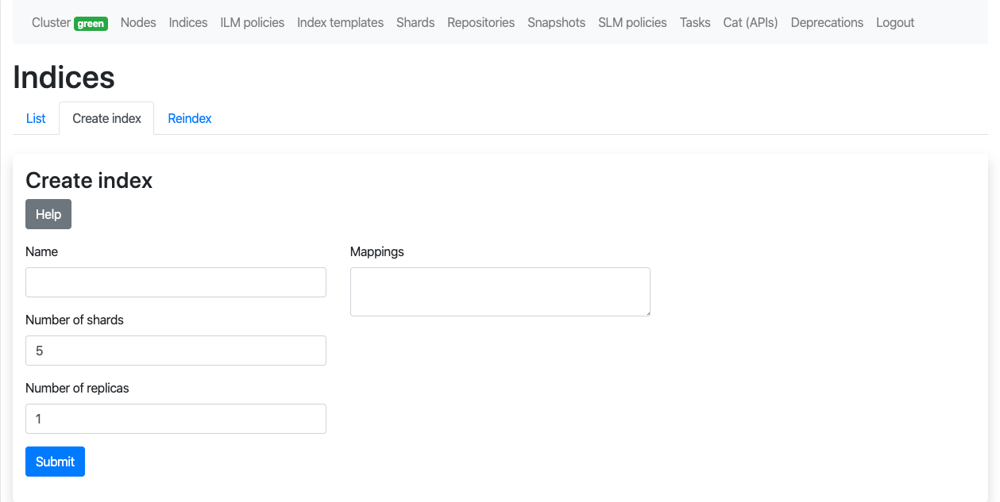

## Requirements

- PHP 7.2.5 or higher
- PHP extensions: ctype, iconv, tokenizer, xml
- Composer
- Yarn

## Installation

Configure a vhost with the document root set to "public" folder (ie /var/www/elasticsearch-admin/public)

```
composer install

yarn install
yarn encore production

bin/console security:encode-password
# Encode a password

cp .env.dist .env
# Edit ELASTICSEARCH_URL, ELASTICSEARCH_USERNAME, ELASTICSEARCH_PASSWORD, EMAIL and ENCODED_PASSWORD
```

### Features

- [x] Connection to Elasticsearch: server-side (no CORS config), local (private) or remote server, http or https, with credentials or not
- [x] Login: user managed by Symfony, not related to Elasticsearch
- [x] Cluster: basic metrics, settings
- [x] Nodes: list, read, usage, plugins
- [x] Indices: list, reindex, create, read, delete, close, open, force merge, clear cache, flush, refresh
- [x] Documents (by index): list
- [x] Aliases (by index): list, create, delete
- [x] Index templates: list, create, read, update, delete
- [x] Index lifecycle management policies: list, status, start, stop, read
- [x] Shards: list
- [x] Repositories: list, create (fs, s3, gcs), read, update, delete, cleanup, verify
- [x] Snapshots: list, create, read, delete, failures, restore
- [x] Snapshot lifecycle management policies: list, status, start, stop, create, read, update, delete, execute, history, stats
- [x] Tasks: list
- [x] Cat APIs: list
- [x] Deprecations info
- [x] License: read, start trial, revert to basic, features

### Todo

- [ ] Indices: update mappings
- [ ] Index lifecycle management policies: create, update, delete
- [ ] Documents (by index): filter, delete
- [ ] Cluster: update settings, reroute
- [ ] Repositories: create (url, source, hdfs, azure)

## Screenshots


---

---

---

---

---

---

---

---

---

---

---

