## Requirements

- PHP 7.2.5 or higher
- Composer
- npm

## Installation

Configure a vhost with the document root set to "public" folder (ie /var/www/elasticsearch-admin/public)

```
composer install

npm install
npm run build

bin/console security:encode-password
# Encode a password

cp .env.dist .env
# Edit ELASTICSEARCH_URL, EMAIL and ENCODED_PASSWORD
# If Elasticsearch security features are enabled, edit ELASTICSEARCH_USERNAME and ELASTICSEARCH_PASSWORD
```

## Features

- [x] Connection to Elasticsearch: server-side (no CORS config), local (private) or remote server, http or https, with credentials or not
- [x] Login: user managed by Symfony, not related to Elasticsearch
- [x] Cluster: basic metrics, allocation explain, list settings, update settings (transient or persistent)
- [x] Nodes: list, read, usage, plugins, reload secure settings
- [x] Indices: list, reindex, create, read, update (mappings), lifecycle (explain, remove policy), delete, close, open, freeze, unfreeze, force merge, clear cache, flush, refresh, empty, import (XLSX) / export (CSV, TSV, ODS, XLSX, GEOJSON), aliases (list, create, delete)
- [x] Index templates: list, create, read, update, delete
- [x] Index lifecycle management policies: list, status, start, stop, create, read, update, delete
- [x] Shards: list
- [x] Repositories: list, create (fs, s3, gcs), read, update, delete, cleanup, verify
- [x] Snapshots: list, create, read, delete, failures, restore
- [x] Snapshot lifecycle management policies: list, status, start, stop, create, read, update, delete, execute, history, stats
- [x] Users (native realm): list, create, read, update, delete, enable, disable
- [x] Roles: list, create, read, update, delete
- [x] Tasks: list
- [x] Remote clusters: list
- [x] Enrich policies: list, stats, create, read, delete, execute
- [x] Pipelines: list, read
- [x] Cat APIs: list
- [x] Console
- [x] Deprecations info
- [x] License: read, start trial, revert to basic, features

## Todo

- [ ] Repositories: create (url, source, hdfs, azure)

## Screenshots

[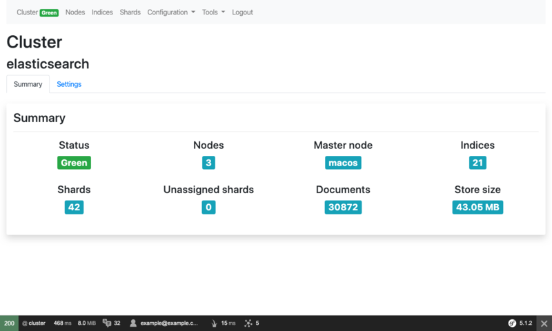](assets/images/original-cluster.png)

[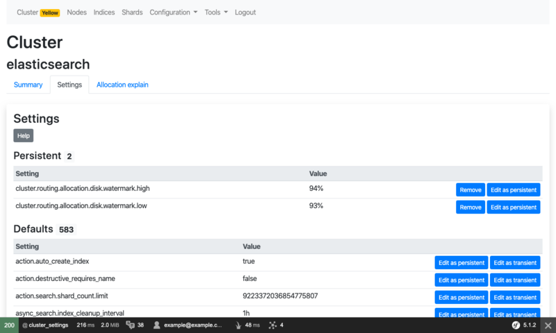](assets/images/original-cluster-settings.png)

[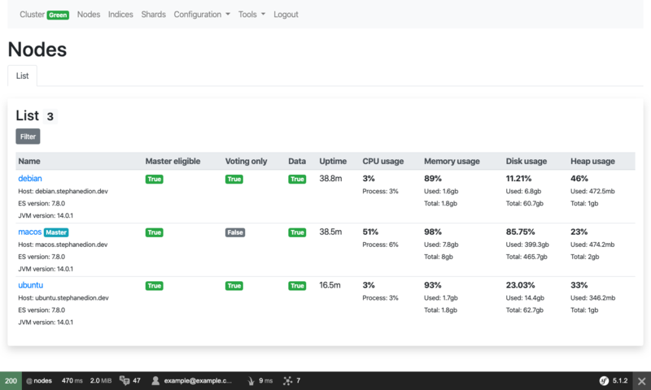](assets/images/original-nodes.png)

[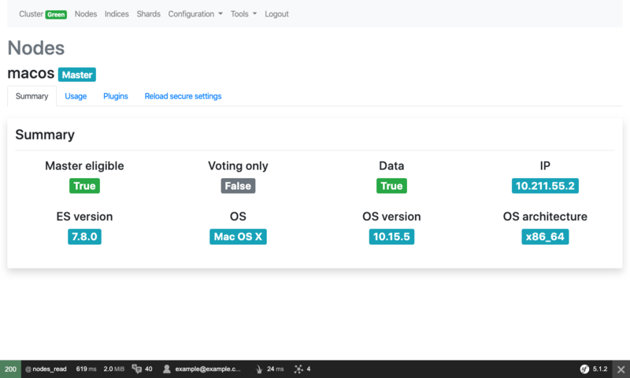](assets/images/original-node.png)

[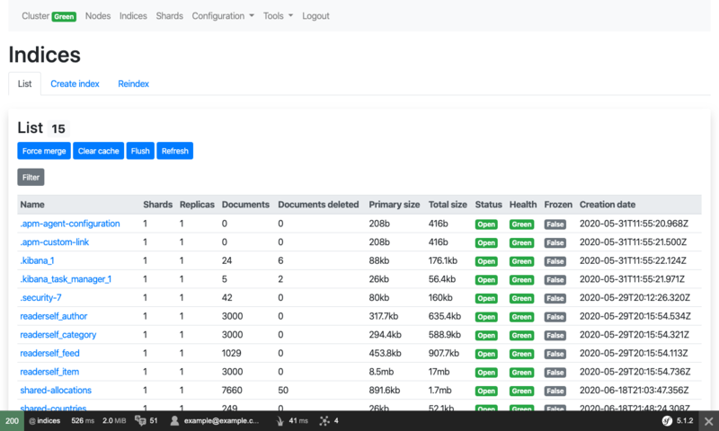](assets/images/original-indices.png)

[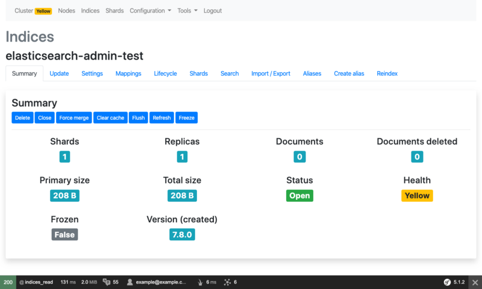](assets/images/original-index.png)

[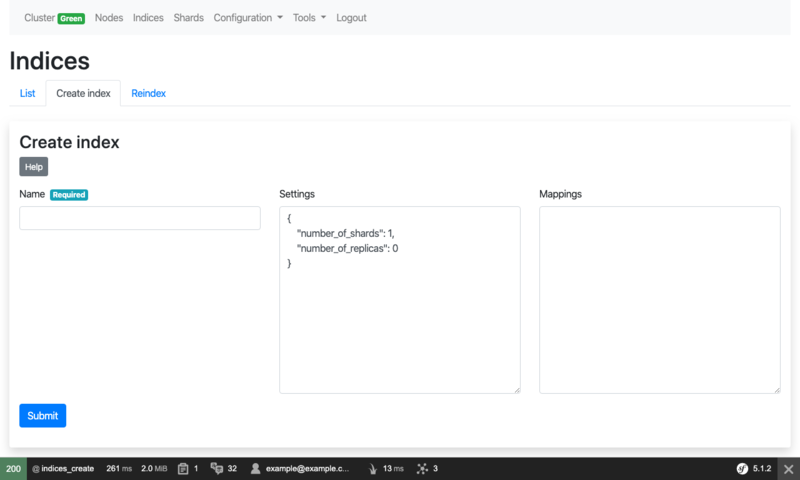](assets/images/original-index-create.png)

[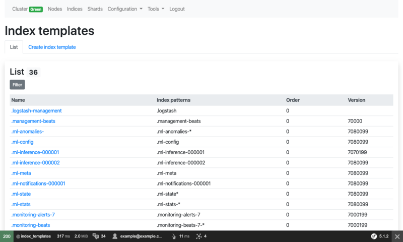](assets/images/original-index-templates.png)

[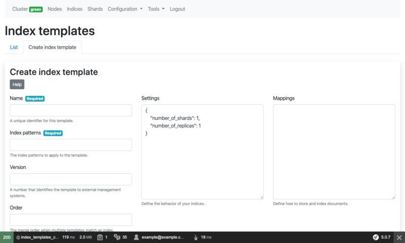](assets/images/original-index-template-create.png)

[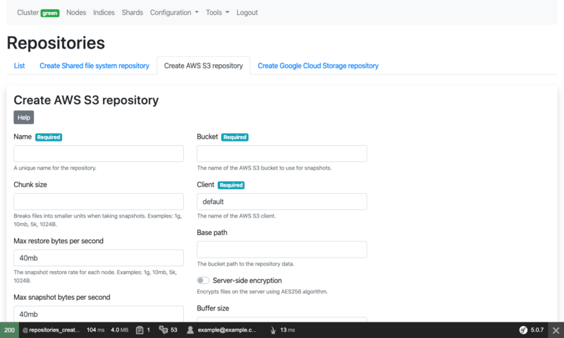](assets/images/original-repository-create-s3.png)

[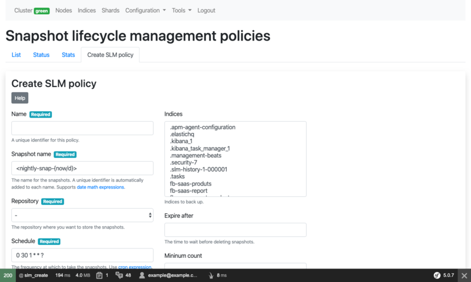](assets/images/original-slm-policy-create.png)

[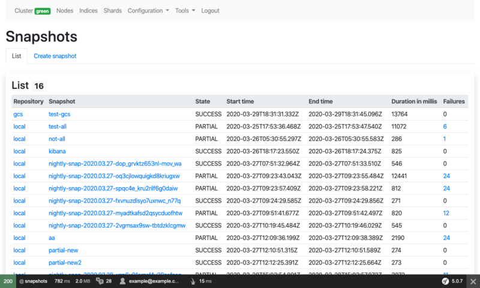](assets/images/original-snapshots.png)

[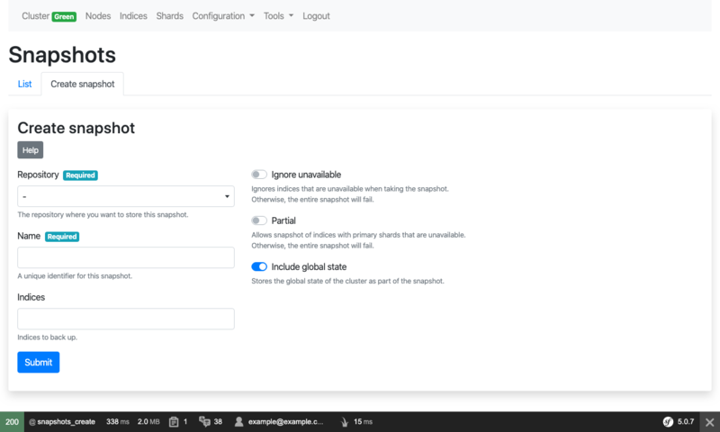](assets/images/original-snapshot-create.png)

[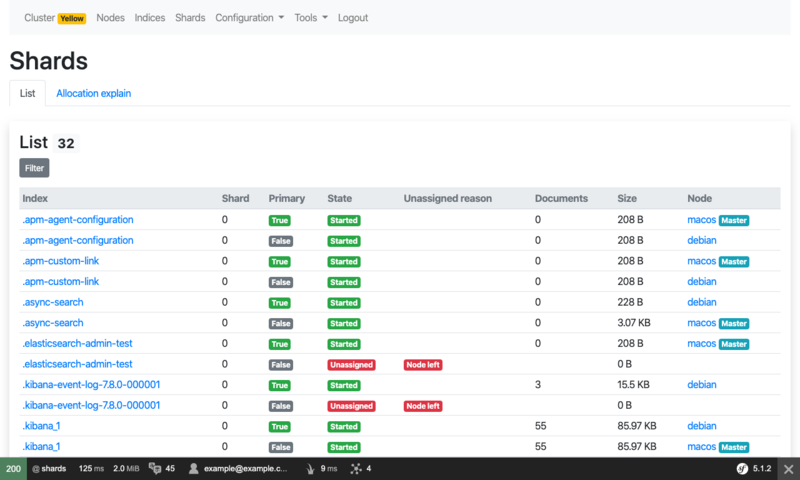](assets/images/original-shards.png)

[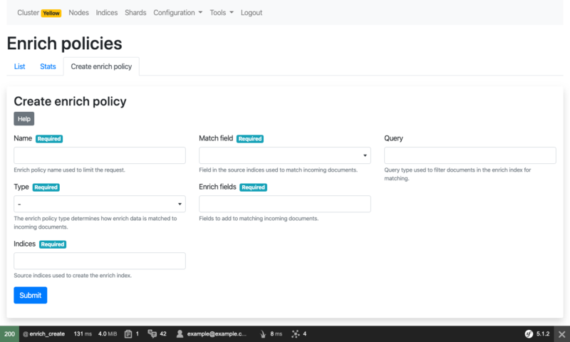](assets/images/original-enrich-create.png)
